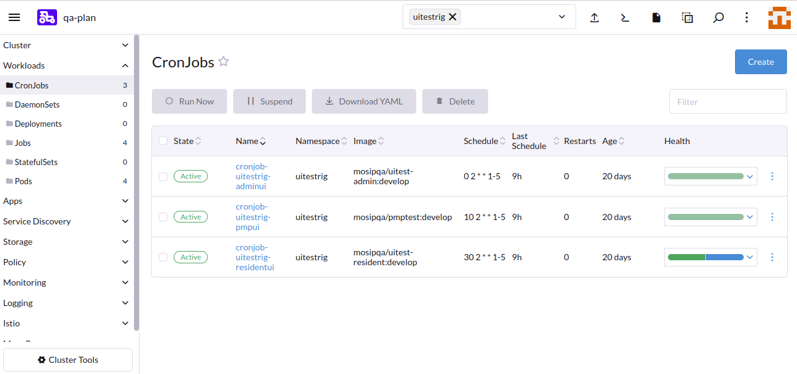

# UITESTRIG

## Introduction
UITESTRIG will test end-to-end functional flows involving multiple UI modules.

### Note: Before installing ui-testrig make sure the values file is updated as per requirement.

## Install
* Install
```sh
./install.sh
```

## Uninstall
* To uninstall UITESTRIG, run `delete.sh` script.
```sh
./delete.sh 
```

## Run UITESTRIG manually

#### CLI
* Download Kubernetes cluster `kubeconfig` file from `rancher dashboard` to your local.
* Install `kubectl` package to your local machine.
* Run UITESTRIG manually via CLI by creating a new job from an existing k8s cronjob.
  ```
  kubectl --kubeconfig=<k8s-config-file> -n UITESTRIG create job --from=cronjob/<cronjob-name> <job-name>
  ```
  example:
  ```
  kubectl --kubeconfig=/home/xxx/Downloads/qa4.config -n UITESTRIG create job --from=cronjob/cronjob-uitestrig cronjob-uitestrig
  ```

## Run ui-testrig using rancher-ui

#### Rancher UI
* Run ui-testrig manually via Rancher UI.
  
* There are 5 cronjobs for ui-testrig:
   - adminui
   - pmp-ui
   - resident-ui
   - verify-ui
   - injiweb-ui
* select the cronjob which you want to initiate and select the `Run Now` button as shown in the above picture.
* Once the job is completed the reports will be avaiable in `S3/minio`.
